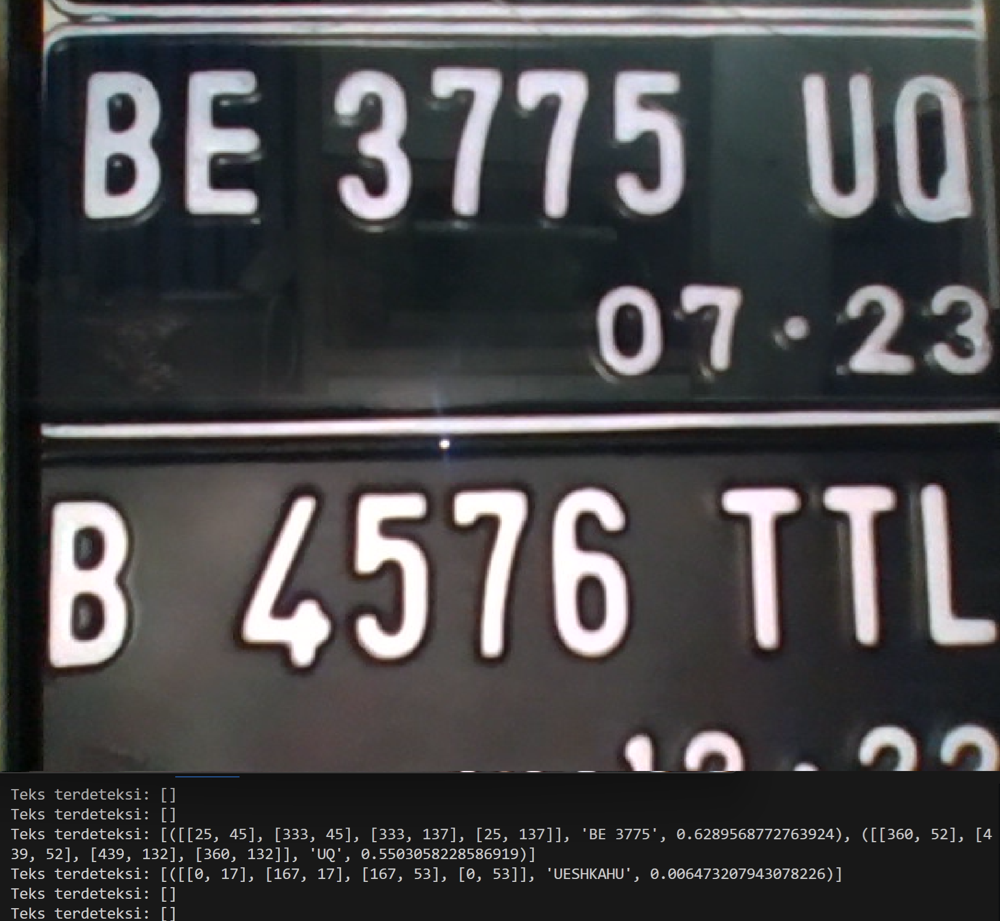
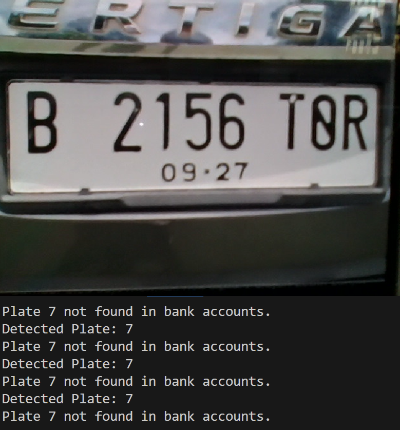
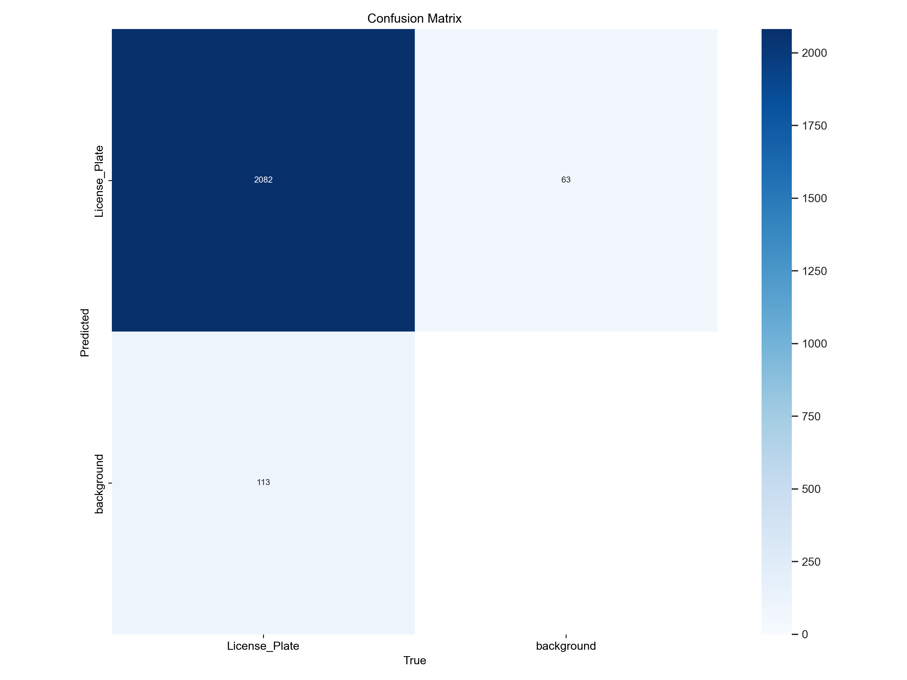
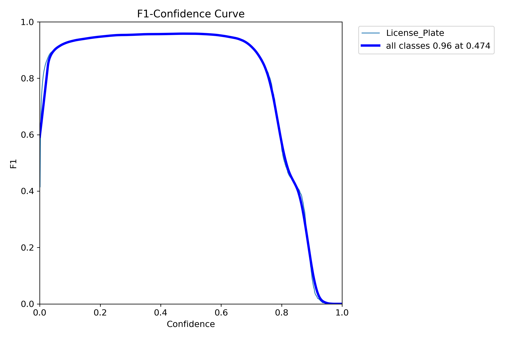
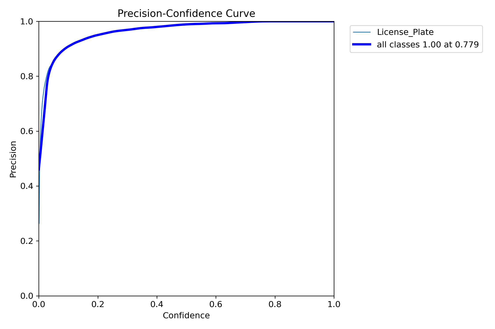
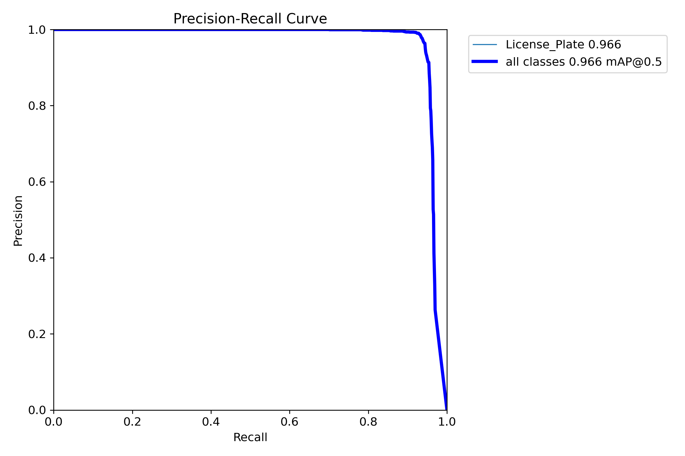
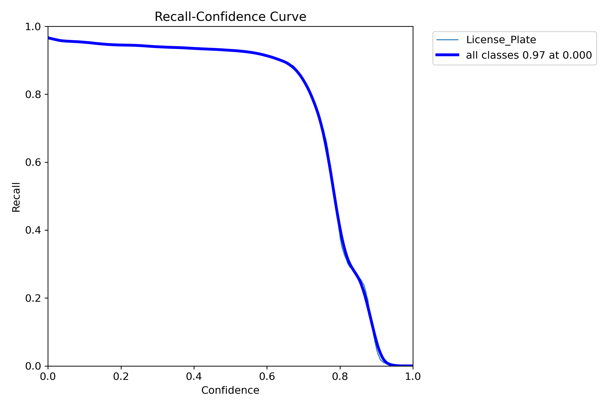
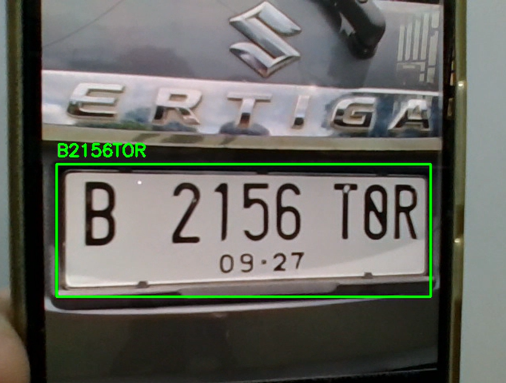
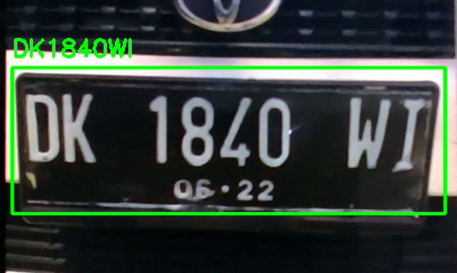

# License-Plate-Recognition

This computer vision project implements four distinct models for **License Plate Recognition (LPR)** and integrates a **Toll Payment System**. It explores both traditional and modern approaches, highlighting the advantages and limitations of each.

---

## Table of Contents

- [Overview](#overview)
- [Features](#features)
- [Models](#models)
- [Installation](#installation)
- [Usage](#usage)

---

## Overview

This project is designed to:
1. **Detect license plates** from video streams.
2. **Recognize license plate numbers** using machine learning and OCR techniques.
3. **Automate toll payment** by integrating recognized plates with a database of accounts.

---

## Features

- Supports real-time video processing.
- Two traditional and two modern LPR models:
  - Traditional: SVM + CAMShift + Haarcascade, Edge Detection.
  - Modern: YOLOv8 + Tesseract, EasyOCR + HOG + SVM.
- Automated toll payment for recognized license plates.

---

## Models

### Traditional Models

1. **SVM + CAMShift + Haarcascade**
  - This model can be found in the **SVMCAM** folder.

  - Data Preparation
    - In order to train our SVM model, we gathered a dataset for positive samples and a dataset for negative samples.  
      - The positive sample set is comprised of images of cars with license plates visible, sourced from [Dataset plat nomor](https://universe.roboflow.com/project-gpyt3/dataset-plat-nomor-53fyf-qdcxw) on Roboflow.  
      - The negative sample set consists of images of non-license plate objects, such as scenes without vehicles or close-ups of random objects, sourced from [People Detection](https://universe.roboflow.com/leo-ueno/people-detection-o4rdr), also on Roboflow.  
    - All images were resized to 128x128 pixels and converted to grayscale for uniformity in processing.  
    - We extracted HOG (Histogram of Oriented Gradients) features from each image, capturing the structural patterns essential for license plate recognition.  
    - The extracted features were normalized using `StandardScaler` to improve the performance and convergence of the SVM during training.  
    
  - Model Training
    - We divided the processed features into training and testing sets, and a Support Vector Machine (SVM) classifier was trained on this dataset.  
    - The SVM learns to distinguish between images containing license plates (positive samples) and those without (negative samples).  
    - The trained SVM model and the scaler for feature normalization were saved using `joblib` for use in real-time detection.  
    
  - License Plate Detection
    - We capture video from a webcam and process each frame to detect license plates.  
    - We used A Haar cascade classifier (`haarcascade_russian_plate_number.xml`) to identify potential license plate regions in the frame. We also noticed that the usage of a haar cascade classifier immensely improved the speed of detection.  
    - For each detected region, the ROI (Region of Interest) is resized to 128x128 pixels and converted to grayscale.  
    - CLAHE (Contrast Limited Adaptive Histogram Equalization) is applied to enhance the region, improving the clarity of the text and edges for better classification.  
    - The enhanced ROI's HOG features are extracted, normalized using the pre-trained scaler, and passed to the SVM model for classification.  
    - If the SVM predicts that the ROI contains a license plate, the program proceeds to the OCR (Optical Character Recognition) stage.
    
  - Optical Character Recognition (OCR)
    - EasyOCR is used to extract text from the detected license plate regions.  
    - The ROI is further preprocessed using CLAHE to enhance contrast and improve OCR accuracy.  
    - EasyOCR reads the text from the enhanced ROI and returns the extracted license plate characters.
   
  - Evaluation
    - Unfortunately, even with the improvements we saw by implementing a haar cascade classifier, this model is still extremely slow and failed to read license plates in a timely manner. The model also saw difficulty in identifying license plates, leading to failed detections. It also has a tendency to split up a license plate into multiple parts due to the spaces in between characters.
   

      

2. **Edge Detection**
   - This model can be found in the **EdgeDetection** folder.
   
   - Data Preparation
     - In this model, we used no external datasets are used for training, as the approach focuses on edge detection and OCR to identify license plates from real-time camera input.
     - The process involves capturing video frames and applying various image processing techniques to detect the license plate area, then using OCR to read the text.

   - Image Processing and Edge Detection
     - The video feed is captured using a webcam, and each frame undergoes preprocessing to enhance edge features for license plate recognition.  
       - First, the frame is resized to a width of 600 pixels for consistency in processing.  
       - It is then converted to grayscale to simplify the image and focus on structural features.  
       - Morphological transformations (using rectangular kernels) such as Blackhat and Close operations help highlight areas of interest, such as the license plate.  
       - We applied the Sobel operator to calculate the gradient in the x-direction, which is then normalized and blurred to reduce noise and enhance important features.  
       - Thresholding techniques are used to create a binary image that highlights the areas of interest for further contour detection.

   - Contour Detection and License Plate Region Identification
     - After preprocessing, we detect potential license plate regions by finding contours in the thresholded image.  
       - The contours are sorted by area, and the top 15 largest ones are examined for a possible match to the license plate.
       - Each contour is analyzed for an appropriate aspect ratio (width-to-height ratio), which helps identify regions that could correspond to license plates.  
       - The first contour that meets the criteria is selected, and a bounding box is drawn around it.

   - Optical Character Recognition (OCR)
     - Once a potential license plate region is identified, the region of interest (ROI) is extracted from the grayscale image.  
     - A thresholding technique is applied to the ROI to make it suitable for OCR.  
     - The image is cleaned up using clear_border from the skimage.segmentation module to remove extraneous artifacts along the edges.  
     - Tesseract OCR is used to extract alphanumeric characters from the ROI. The OCR configuration is set to recognize only uppercase letters and numbers to match typical license plate formats.  
       - The result is cleaned up by removing any non-ASCII characters before returning the detected license plate text.
     
   - Evaluation
     - This model's poor performance is very noticable, both in terms of speed and accuracy. It fails to find the correct bounding box consistently, which causes the recognition result to be very poor.

### Modern Models

#### Training our YOLOv8 model
- Our YOLOv8 model was trained using a diverse [license plate dataset](https://universe.roboflow.com/roboflow-universe-projects/license-plate-recognition-rxg4e) from Roboflow. We trained the model through 20 epochs and saved the weights into a `.pt` file that is [available for download](https://github.com/shilva45/License-Plate-Recognition/blob/main/YOLO-Model/best.pt). This training led to a result of 98.791% precision and 93.065% recall. The confusion matrix is as follows:

As well as the F1, Precision and Recall Curves:

3. **YOLO + Tesseract**  
   - This model can be found in the **YOLO-Tesseract** folder.  

   - Data Preparation  
     - We utilized our pre-trained YOLOv8 model to detect license plates in images and combined it with Optical Character Recognition (OCR) to extract text from the detected regions.
     - For testing, we used images of [vehicles with license plates](https://universe.roboflow.com/project-gpyt3/dataset-plat-nomor-53fyf-qdcxw) sourced from Roboflow.  

   - License Plate Detection  
     - We employed the YOLOv8 model to identify potential license plate regions within the input images.  
       - First, we read the input image using OpenCV and passed it to the YOLO model for processing.  
       - The model output provided bounding boxes, confidence scores, and class IDs for detected regions.  
       - We visualized the results by drawing bounding boxes around the detected regions on the image.  

   - Optical Character Recognition (OCR)  
     - After identifying license plate regions, we extracted these areas and passed them through our custom OCR pipeline for text recognition.  
       - Each detected bounding box was cropped from the input image, converted to grayscale, and preprocessed using Gaussian blur and thresholding to enhance readability.  
       - We configured Tesseract OCR with specific settings (`--psm 7 --oem 3`) to maximize recognition accuracy.  
       - To ensure accuracy, we cleaned the extracted text by:  
         - Removing unnecessary whitespace and converting the text to uppercase.  
         - Filtering out non-alphanumeric characters.  
         - Correcting common errors, such as removing extraneous leading "I" characters.  
       - A regular expression was applied to validate that the text conformed to standard license plate formats (e.g., a combination of letters, digits, and optional suffixes).  

   - Handling Cases with No Detections  
     - If the YOLO model failed to detect any license plates in an image, we treated the entire image as a potential license plate region.  
       - We applied the same OCR pipeline to this region, attempting to extract text.  
       - The results were cleaned and processed similarly to detected regions.
  
   - Evaluation
     - Employing YOLO has given rise to noticable improvements over the two traditional methods. YOLO is much faster and much more accurate, leading to correct readings a majority of the time. Tesseract also performs well, but struggles when large spaces exists between sections of the license plate, most often seen when the left side or right side of the plate only consists of one letter. This causes Tesseract to prematurely declare the wrong license plate.

4. **YOLO + EasyOCR**
   - This model can be found in the **YOLO-EasyOCR** folder.  

   - Data Preparation  
     - We utilized our pre-trained YOLOv8 model to detect license plates in images and combined it with Optical Character Recognition (OCR) to extract text from the detected regions.
     - For testing, we used images of [vehicles with license plates](https://universe.roboflow.com/project-gpyt3/dataset-plat-nomor-53fyf-qdcxw) sourced from Roboflow.  

   - License Plate Detection  
     - We employed the YOLOv8 model to identify potential license plate regions within the input images.  
       - First, we read the input image using OpenCV and passed it to the YOLO model for processing.  
       - The model output provided bounding boxes, confidence scores, and class IDs for detected regions.  
       - We visualized the results by drawing bounding boxes around the detected regions on the image.

   - Optical Character Recognition (OCR)  
     - For each detected region, we extracted the bounding box and passed it to EasyOCR for text recognition.  
       - The cropped image was converted to grayscale for better accuracy during OCR processing.  
       - EasyOCR analyzed the cropped region, identifying the text with a confidence threshold of 0.2 to filter low-confidence results.  
       - To select the most probable license plate text, we considered the largest text region based on area.  
       - We cleaned the detected text by:  
         - Removing unnecessary spaces and converting it to uppercase.  
         - Filtering out non-alphanumeric characters to ensure only valid license plate text was retained.  
         - Correcting common issues, such as removing a leading "I" character if it was incorrectly recognized.  
       - A regular expression was applied to validate the format of the recognized text, ensuring it matched standard license plate patterns.  

   - Handling Cases with No Detections  
     - When the YOLO model failed to detect any license plates in a frame, we processed the entire frame using EasyOCR.  
       - The resulting text was cleaned and validated in the same way as detected regions.  
       - This fallback ensured that our system attempted to recognize text even in challenging scenarios.
  
   - Evaluation
     -  Using the same YOLO model, this method showed the same ability of consistently identifying license plates and displaying accurate bounding boxes. However, we found that EasyOCR had an easier time in recognizing characters compared to Tesseract, causing EasyOCR to perform far better in reading license plates. Tesseract's issue of misreading license plates due to spaces are less noticable, and so we determine that YOLO + EasyOCR performed the best out of all our models.
    

---

## Installation

### Prerequisites
- Python 3.8 or later
- OpenCV
- Tesseract OCR
- YOLOv8 (Ultralytics)
- EasyOCR
- Required Python libraries: `numpy`, `imutils`, `scikit-learn`, `scikit-image`, `joblib`

---

## Usage

- To use any of our models, simply download their respective folder and run the .py file.
